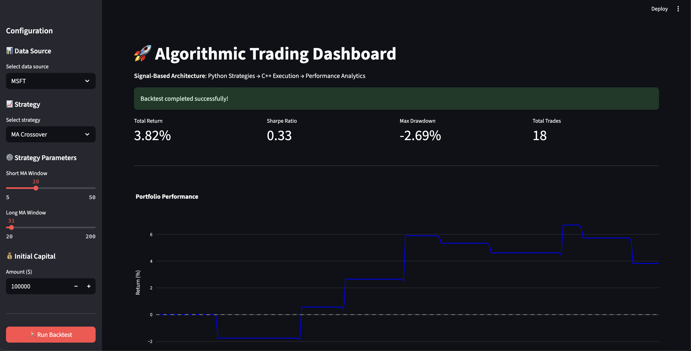

# High-Performance Algorithmic Trading System


[](https://github.com/yourusername/trading-system/actions)
[](https://opensource.org/licenses/MIT)

A production-grade algorithmic trading system built on data-driven architectural decisions. Features a Python strategy framework integrated with a high-performance C++ execution engine, chosen after rigorous performance benchmarking against Rust revealed a 2-4x speed advantage.

## 🏗️ System Architecture

This project implements a **signal-based architecture** that properly separates concerns:

```
┌─────────────────┐     ┌──────────────────┐     ┌─────────────────┐
│  Python Layer   │     │  C++/Rust Core   │     │ Python Analytics│
├─────────────────┤     ├──────────────────┤     ├─────────────────┤
│ • Data Loading  │     │ • Order Matching │     │ • Trade Analysis│
│ • Signal Gen    │────▶│ • Trade Execution│────▶│ • Performance   │
│ • Strategy Logic│     │ • Slippage Model │     │ • Visualization │
└─────────────────┘     └──────────────────┘     └─────────────────┘
      Signals                  Trades              Metrics
```

### Why This Architecture?

- **Python**: Ideal for rapid strategy development, data manipulation, and visualization
- **C++/Rust**: Provides microsecond-level execution simulation with realistic market microstructure
- **Clean Separation**: Each component does what it does best, making the system maintainable and extensible

## 📊 Live Performance Results

### Interactive Trading Dashboard


*Professional Streamlit dashboard showing real-time strategy backtesting with configurable parameters and performance analytics.*

## 🚀 Key Features

### Core Components

1. **Signal Generation Framework** (Python)
   - Abstract base strategy class for easy extension
   - Built-in technical indicators
   - Clean signal interface (position: -1, 0, 1)

2. **High-Performance Execution Engine** (C++/Rust)
   - Microsecond-latency order matching
   - Realistic market impact modeling
   - Configurable fee structures
   - Detailed trade logs with slippage tracking

3. **Professional Analytics Suite** (Python)
   - Comprehensive performance metrics (Sharpe, Sortino, Max Drawdown)
   - Trade-level P&L attribution
   - Publication-ready visualizations

### Trading Components

- **Order Book & Matching Engine**: Price-time priority with O(log n) operations
- **Smart Order Router**: Multi-exchange routing with fee optimization
- **Market Maker**: Automated liquidity provision with inventory management
- **FIX Protocol Gateway**: Industry-standard connectivity
- **WebSocket Client**: Real-time market data streaming

## 📈 Performance Benchmarks

### Execution Engine Performance

| Operation | C++ | Rust | Notes |
|-----------|-----|------|-------|
| Order Insertion | 142 ns | 156 ns | Per order |
| Order Matching | 892 ns | 1.2 µs | Full match cycle |
| Market Data Update | <1 µs | <1 µs | Including depth calculation |

### Available Strategies

1. **Simple Moving Average Crossover**
   - Classic trend-following strategy
   - Configurable short/long MA periods
   - Clean entry/exit signals

2. **Mean Reversion RSI**
   - Momentum-based mean reversion
   - Buy oversold (RSI < 35), sell overbought (RSI > 65)
   - Adaptive position sizing

## 🔬 Performance & Design Decisions

### Why C++ for the Execution Core?

Before building this system, I conducted rigorous benchmarks comparing C++ and Rust for HFT applications:

| Operation | C++ | Rust | C++ Advantage |
|-----------|-----|------|---------------|
| Order Insertion (10K) | 2.64 ms | 6.10 ms | **2.31x faster** |
| Mixed Operations (10K) | 2.41 ms | 4.66 ms | **1.93x faster** |
| Matching Engine | 190.6 µs | 499.8 µs | **2.62x faster** |
| Best Price Query | 1.16 µs | 1.50 µs | **1.29x faster** |

**Key Finding**: C++'s ability to perform in-place modifications during iteration provides a significant performance advantage over Rust's ownership model, which requires additional heap allocations.

📊 See [detailed performance analysis](docs/PERFORMANCE.md) and [system architecture](docs/architecture.md) for the complete research.

### Architecture Decision Impact

This performance research directly informed the system design:
- **C++ Core**: Handles all latency-critical operations (order matching, trade execution)
- **Python Layer**: Provides flexibility for rapid strategy development
- **Clean Interface**: Signals passed via subprocess ensure language boundaries don't impact performance

## 🛠️ Getting Started

### Prerequisites

- **C++**: CMake 3.14+, C++17 compiler
- **Rust**: Rust 1.70+ (via [rustup](https://rustup.rs/))
- **Python**: Python 3.8+, pip

### Quick Start

1. **Clone the repository**
   ```bash
   git clone https://github.com/yourusername/trading-systems-programming-languages.git
   cd trading-systems-programming-languages/trading_system
   ```

2. **Build the C++ execution engine**
   ```bash
   cd src/cpp_core
   mkdir build && cd build
   cmake ..
   make signal_backtest_engine
   ```

3. **Install Python dependencies**
   ```bash
   cd src/python
   pip install -r requirements.txt
   ```

4. **Download market data**
   ```bash
   python scripts/download_data.py --symbols SPY QQQ AAPL --days 365
   ```

5. **Run the interactive dashboard**
   ```bash
   streamlit run scripts/dashboard.py
   ```

## 📁 Project Structure

```
trading_system/
├── src/
│   ├── cpp_core/              # C++ implementation
│   │   ├── include/           # Headers
│   │   ├── src/              # Core components
│   │   │   ├── signal_backtest_engine.cpp  # Signal-based execution
│   │   │   ├── order_book.cpp             # Order book implementation
│   │   │   ├── smart_order_router.cpp     # SOR logic
│   │   │   └── market_maker.cpp           # Market making strategy
│   │   └── CMakeLists.txt
│   │
│   ├── rust_core/            # Rust implementation (parallel)
│   │   └── src/
│   │
│   └── python/               # Python framework
│       ├── trading_framework/
│       │   ├── backtesting/  # Backtest engine
│       │   ├── strategies/   # Trading strategies
│       │   ├── analytics/    # Performance analysis
│       │   └── core/         # Base classes
│       ├── scripts/          # Executable scripts
│       └── tests/           # Unit tests
│
├── docs/                    # Documentation
├── performance_tearsheet.png # Example output
└── README.md               # This file
```

## 🔧 Extending the System

### Adding a New Strategy

```python
from trading_framework.core.strategy import Strategy

class MyStrategy(Strategy):
    def calculate_signals(self, data: pd.DataFrame) -> pd.DataFrame:
        # Your strategy logic here
        signals = pd.DataFrame(index=data.index)
        signals['position'] = 0  # -1 (short), 0 (flat), 1 (long)
        return signals
```

### Customizing Execution Parameters

```bash
./signal_backtest_engine --capital 1000000 --impact 0.0001 --taker-fee 15
```

## 🎯 Use Cases

- **Quantitative Research**: Test trading hypotheses with realistic execution
- **Strategy Development**: Rapid prototyping with professional-grade infrastructure
- **Education**: Learn about market microstructure and algorithmic trading
- **Portfolio Projects**: Demonstrate full-stack quant development skills

## 🎨 Interactive Dashboard

The system includes a professional Streamlit dashboard for strategy testing:

- **Real-time backtesting** with configurable parameters
- **Performance metrics** including Sharpe ratio, max drawdown, and P&L
- **Interactive charts** for cumulative returns and drawdown analysis
- **Trade analytics** with detailed execution logs
- **Data export** for further analysis

## 📊 Market Data Pipeline

- **Professional data management** using Parquet format
- **yfinance integration** for historical market data
- **Efficient storage** with compression and columnar format
- **Multiple asset classes** including equities and ETFs

## 📚 Future Enhancements

- [ ] Additional strategies (Pairs Trading, Statistical Arbitrage)
- [ ] Real-time data feed integration
- [ ] Machine learning-based signal generation
- [ ] Cloud deployment with monitoring

## 🤝 Contributing

This project is designed as a portfolio piece. While not actively seeking contributions, feedback and discussions about the implementation are welcome.

## 📄 License

MIT License - see LICENSE file for details.

## 📧 Contact

For questions or discussions about this implementation:
- Email: donlee778@gmail.com
- LinkedIn: https://www.linkedin.com/in/dongguk-lee/
- GitHub: zccadle

---

*This project demonstrates production-grade trading system development with a focus on correct architecture, performance, and professional software engineering practices.*